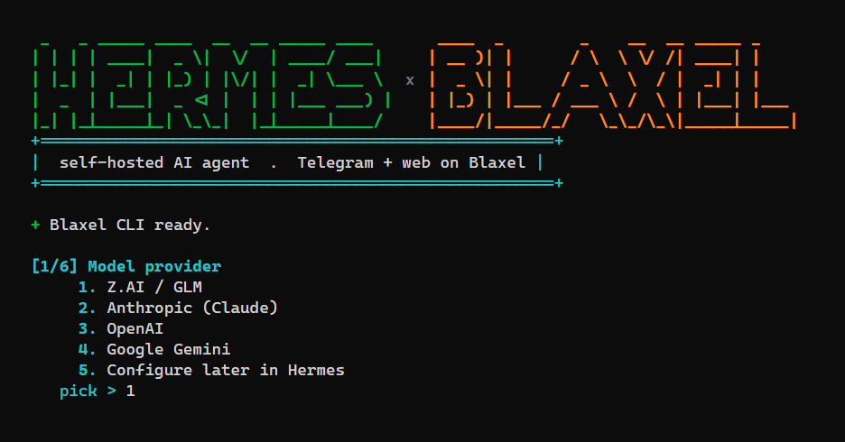

# Hermes on Blaxel

[](LICENSE)




Run your own [Hermes Agent](https://github.com/NousResearch/hermes-agent) as a **Telegram bot** (plus an
optional **web dashboard**) on a [Blaxel](https://blaxel.ai) cloud sandbox. Clone the repo, run one wizard,
answer a few prompts, and you have a live agent. Bring **any model provider** and choose **always-on** or
**scale-to-zero**.

> **Status: beta.** The end-to-end flow has only been run lightly so far. Expect rough edges, and please
> open an issue if something breaks. PRs welcome.

## Why

- **One-command setup.** A cross-platform wizard (Windows / macOS / Linux) generates secrets, deploys the
  sandbox, wires the Telegram webhook, and prints your bot handle + dashboard link.
- **Any provider.** Z.AI / GLM, Anthropic, OpenAI, Gemini, Kimi, and more. Or pick "configure later" and
  set it up from the dashboard. Not tied to one vendor.
- **Cheap or instant, your call.** `scale-to-zero` sleeps when idle and wakes on a message (~nothing at
  rest); `always-on` keeps it warm for instant replies.
- **Self-healing.** A supervision loop relaunches the gateway/dashboard after sleep or a crash.
- **Optional web dashboard** with a username/password login: in-browser chat, sessions, cost, config.

## Quickstart

**1. Install the Blaxel CLI and log in**

```powershell
# Windows (PowerShell)
irm https://raw.githubusercontent.com/blaxel-ai/toolkit/main/install.ps1 | iex
bl login
```
```bash
# macOS / Linux
curl -fsSL https://raw.githubusercontent.com/blaxel-ai/toolkit/main/install.sh | sh
bl login
```

**2. Clone the repo and run the wizard**

```powershell
# Windows
./scripts/setup.ps1
```
```bash
# macOS / Linux  (needs bash, curl, openssl - preinstalled on macOS/Linux)
chmod +x scripts/*.sh
./scripts/setup.sh
```

The wizard asks for: your **model provider + key** (or "configure later"), your **Telegram bot token**
(@BotFather) and **user id** (@userinfobot), the **dashboard** (optional), and the **run mode**. Then it
deploys and prints everything.

> **Bring your own provider:** choose "configure later" in the wizard, then set the provider/model/keys
> after deploy via the **dashboard** or `bl connect sandbox <name>` then `hermes setup model` (Hermes' own
> multi-provider wizard).

## Deployment modes

| Mode | Behavior | Cost |
|---|---|---|
| **always-on** | Box runs 24/7, instant replies | continuous |
| **scale-to-zero** | Sleeps after ~15 min idle, wakes on a message (~1 min cold start) | ~zero when idle |

## Day-to-day

| Task | Windows (PowerShell) | macOS / Linux (bash) |
|---|---|---|
| Redeploy after a code change | `./scripts/deploy.ps1` | `./scripts/deploy.sh` |
| Change config/secrets only (faster) | `./scripts/deploy.ps1 -SkipBuild` | `./scripts/deploy.sh --skip-build` |
| Back up chat history/memories | `./scripts/backup-data.ps1` | `./scripts/backup-data.sh` |
| Restore after a rebuild | `./scripts/restore-data.ps1 -InFile backups\<file>.tar.gz` | `./scripts/restore-data.sh backups/<file>.tar.gz` |

> A full rebuild resets the box's runtime data (the free tier has no persistent disk), so back up first if
> you care about chat history. See **CLAUDE.md** for architecture, the Blaxel CLI cheat-sheet, and lessons.

## Requirements

- A Blaxel account (free tier works) · an API key for any provider Hermes supports · a Telegram bot token.
- Windows (PowerShell) or macOS/Linux (bash + curl + openssl). The sandbox itself is Linux, in the cloud.

## Contributing

Issues and PRs welcome. See [CONTRIBUTING.md](CONTRIBUTING.md) and [SECURITY.md](SECURITY.md).

## Acknowledgements

Built on the [Hermes Agent](https://github.com/NousResearch/hermes-agent) by **Nous Research** and the
[Blaxel](https://blaxel.ai) sandbox platform. Thanks to both teams for the underlying tools.

## Disclaimer

Unofficial, community project. **Not affiliated with or endorsed by Nous Research or Blaxel.** Provided
as-is under MIT, with no warranty. You are responsible for your own API keys, costs, and whatever your bot
says or does.

## License

[MIT](LICENSE).
